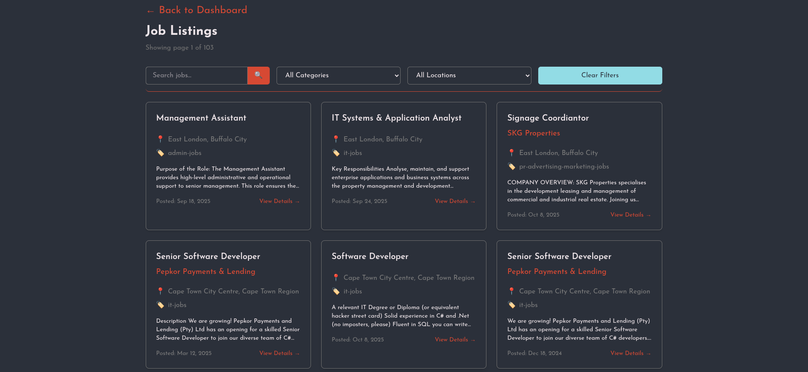
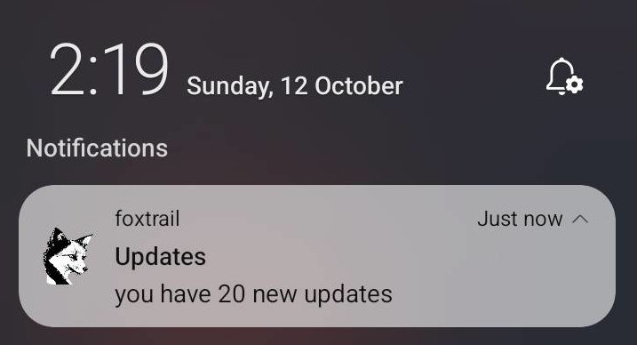

# Foxtrail: Your Unified Job Search Hub

## 🦊 Overview

Foxtrail is the ultimate cross-platform solution for job seekers. Tired of bouncing between dozens of job boards and company career pages? Foxtrail aggregates job listings from various different sites into a single, clean, and powerful interface.

This project is **closed source**, focusing on providing a highly polished, ready-to-use product.

### **Official Website:** [click here](https://fox-trail.netlify.app/)

Whether you are at your desktop, on the web, or on the go, Foxtrail keeps your search streamlined, focused, and up-to-date.

## ✨ Key Features

### Centralized Job Aggregation

- **One Feed, All Jobs:** Automatically pulls job postings from multiple, diverse sources, presenting them in one consolidated feed.

- **Powerful Filtering:** Utilize advanced search parameters to filter results by location, salary range, job type, and more.

### Personalized Experience

- **User Preferences:** Set and save detailed user profiles and preference filters to ensure the job feed is always relevant to your career goals.

<!-- - **Job Saving:** Easily save, categorize, and track jobs you are interested in applying for. -->

### Mobile Notifications (Mobile)

- **Real-Time Alerts:** On mobile receive instant notifications when new jobs matching your saved preferences are posted. Never miss a golden opportunity again!

## 💻 Cross-Platform Availability (Powered by Tauri)

Foxtrail is built using the Tauri framework, ensuring a lightweight, secure, and natively integrated experience across all major operating systems. This commitment to cross-platform design means your job search is always accessible, no matter your device.

| Platform                          | Status    | Download/Access                                                                   |
| :-------------------------------- | :-------- | :-------------------------------------------------------------------------------- |
| **Web**                           | Available | [Access via Official Website](https://fox-trail.netlify.app/)                     |
| **Mobile (Android)**              | Available | [Download via Releases](https://github.com/FoxwareDen/Foxtrail-frontend/releases) |
| **Desktop (Windows/macOS/Linux)** | Available | **Future release coming**                                                         |

<!-- *[Download via Releases](#📥-downloads--releases) -->

## 📥 Downloads & Releases

All application releases, including desktop installers and mobile application files, can be found here:

**[Official Releases Page](https://github.com/FoxwareDen/Foxtrail-frontend/releases)**
